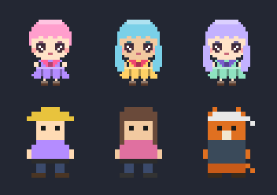

# High-resolution anime chibi drafts — characters

Draft for the todo "try completely different art styles/designs with higher
resolution and more details" — the "cute anime-looking character in a frilly
dress" direction. Unlike everything else in `src/utils/graphics/` (which
transforms the existing 16×16 base grids), this module **builds new 32×32
sprites from scratch**: a chibi character with big glossy eyes,
shine-banded hair (bob or long), a frilly-scarfed dress, a chest bow, and a
scalloped hem. Pure, framework-free, deterministic — no new assets, no new
dependencies.

All of it lives in `src/utils/graphics/animeArt.ts` and is tested in
`src/utils/graphics/animeArt.test.ts` (10 tests: margins, per-look palette
membership, the fixed constants, determinism, non-mutation, non-empty
content, bob-vs-long differing exactly in the front-strand region, fringe +
scalloped-hem structure, custom/default eye colors). It is **not wired into
the app** — this is the draft the decision picks from.

Contact sheet (352×248, dark slate ground so light and dark sprites judge the
same; re-render with `node scripts/generate-anime-art-samples.mjs`):

| sheet | rows |
| --- | --- |
|  | row 1 — the three 32×32 anime looks at their native detail; row 2 — the classic 16×16 character each one replaces, upscaled to the same 96 px display size. Same display size on both rows, so the sheet compares art direction, not content. |

## The three directions

The looks are the fixed tested set (`animeArt.test.ts` / the generator
script). Every non-null pixel of a grid is a member of
`animePalette(look)` — the palette is the whole tuning surface.

**Look 1 — pink bob.** Skin `#ffe3c8`, hair `#ff9ecd` (bob), dress
`#b48cff`, bow `#ff5f9e`. Paired against the classic helmet miner. The bob
reads the face widest (fringe tips + short sides), so the eye-to-face ratio
is the strongest of the three — the most "chibi" of the set.

**Look 2 — teal long.** Skin `#f2c9a0`, hair `#7ad0e8` (long), dress
`#ffd166`, bow `#ef476f`. Paired against the classic long-hair human
(same skin — the pair is the closest color match in the set). The long
style hangs the shine bands down both sides of the dress; the warm
yellow/pink contrast is the boldest palette of the three.

**Look 3 — lavender long.** Skin `#ffe3c8`, hair `#c3b1ff` (long), dress
`#8fe3c0`, bow `#7a5fd0`. Paired against the classic bandana miner. The
coolest palette; reads the most "quiet" — the safe middle if two of the
three get picked and one dropped.

## If a look is picked — adoption notes

- **It replaces the character sprite, it is not a style pass.** The 16×16
  passes (`stylePasses.ts`, `detailPass.ts`) transform the base grids; this
  is new content at 2× the resolution (4× the pixels). The natural hook is
  the miner/character rendering path (the avatar shown on the cave), not
  the cave-tile pipeline — the cave itself stays 16×16.
- **Display size.** At the app's current 2× canvas stretch a 32×32 grid
  renders at 64 px vs. the classic 32 px — i.e. the character roughly
  doubles on screen. If that is too big, render at 1× (32 px, still above
  the classic 16 px native) — the detail survives because the grid, not the
  upscale, carries it.
- **Tuning is palette-only.** Recolor = change the `AnimeLook`; restructure
  = edit the grid builders (hair region is the only part that differs
  between bob and long, pinned by test).
- **Cost.** 32×32 fillRect-per-pixel at canvas scale is negligible (the
  classic sprite is redrawn on the same path); the grid is built once per
  look and cached like the other pixel-art grids.
- **Decision artifact.** If adopted, this file + the generator are kept as
  the source of truth; the sheet is re-rendered by the script, same as the
  other art docs.
