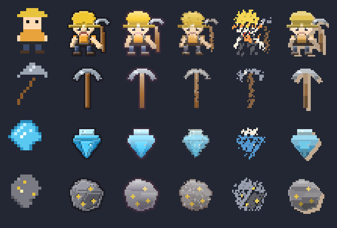
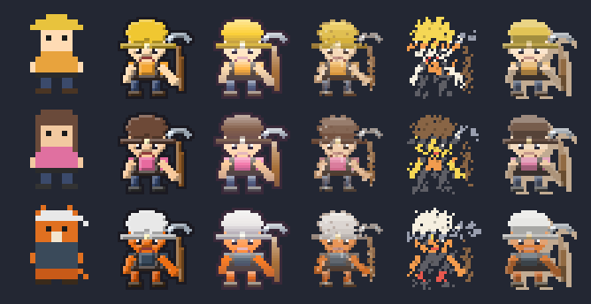
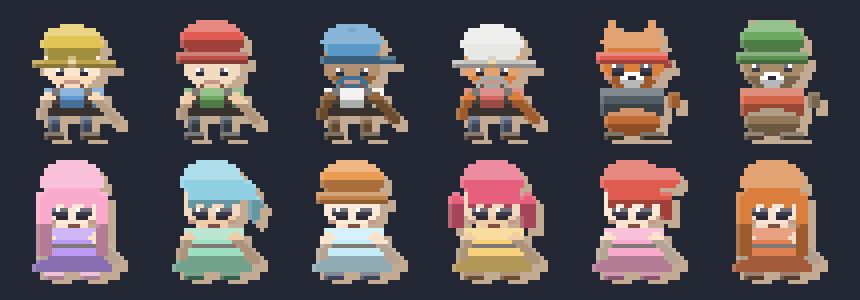
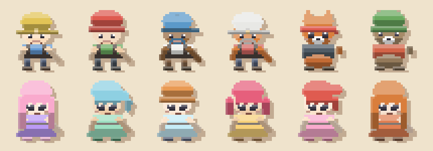
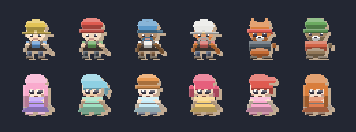
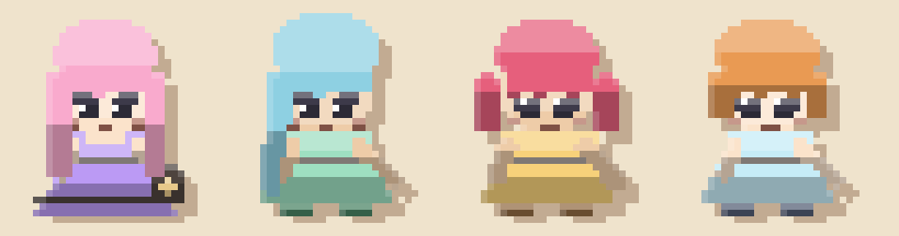

# Art directions — five styles, papercut picked

Draft for the "add more generated art styles (completely different from
current, but thematically apt) such as cartoon, anime…" request. Where the
other three art drafts start from the **live 16×16 grids** and transform them:

| draft | starting point | what it changes |
| --- | --- | --- |
| [art-styles.md](art-styles.md) | the live 16×16 grids | palette / edges (mono, retro16, outline) |
| [art-detail.md](art-detail.md) | the live 16×16 grids | shading (a top-left bevel) |
| [art-anime.md](art-anime.md) | nothing | one hand-built 32×32 chibi character |
| **this doc** | nothing | **five new art directions, four subjects each, at 32×32** |

Everything lives in `src/utils/graphics/characterArt.ts` (pure,
framework-free, deterministic — no `Math.random`, no `Date`, no new assets,
no new dependencies) and is tested in `characterArt.test.ts` (46 tests).

> **Decision (2026-10-02): `papercut`, and it SHIPS.** Papercut is the game's
> art now, behind the art-pack seam
> ([`artPack.ts`](../src/utils/graphics/artPack.ts)): the classic pixel pack
> stays registered beside it, so `setActiveArtPack("pixel")` brings the old
> 16×16 art back with one line. The five directions and the paper-cut skin
> line below are the reference set the decision was made from.

## How it works: one geometry, five ways of marking it

The subjects are drawn **once** into a 32×32 *label map* — material per
pixel (`"hat"`, `"skin"`, `"blade"`, `"ore"` …) instead of color. A direction
is then two pure functions over that map:

1. **a grade** — how the direction recolors a look (`buildPalette`: every
   direction has its own inks, neutrals and paper tint, so a look never leaks
   the cartoon palette into the crayon sheet);
2. **a renderer** — how the direction puts down marks (`renderDirection`:
   where the shadow band goes, whether there is a contour, what the paper
   shows through).

Because the geometry is shared and only the mark-making changes, the sheets
compare **art direction, not content** — the same trick the earlier drafts
use, so the two sets read side by side.

Subjects: `miner` (hard hat + lamp, chibi proportions, raised pickaxe),
`pickaxe`, `gem`, `chunk` (ore-bearing rock).

## How it ships — the art-pack seam

The game never calls `pixelArt.ts` (or `characterArt.ts`) directly. Every
sprite goes through `src/utils/graphics/artPack.ts`:

```
Miner / IapPanel / CollectionPanel / iaps.ts ─┐
DebrisParticles ──────────────────────────────┼─> artPack.minerSpriteUri(…)
MiningCanvas (gem + chunk icons) ─────────────┘         │
                                                        v
                                      ART_PACKS[activeArtPackId()]
                                        ├── pixel     (classic 16×16)
                                        └── papercut  (shipped, 32×32)
```

A pack is five pure builders (`minerSprite`, `pickaxeSprite`, `debrisSprite`,
`mineralChunkSprite`, `gemSprite`) plus its grid size, and the seam caches the
PNGs per (pack, subject, key) so same-variant miners still share one decoded
image. Consequences worth knowing:

- **Swapping the art is one line.** `setActiveArtPack("pixel")`, or flip
  `DEFAULT_ART_PACK_ID`. Nothing else changes — the pixel pack is the old
  grids, byte for byte (pinned by `artPack.test.ts`).
- **Looks keep working.** Both packs take the same `MinerLook` the game
  already rolls. `MinerLook` gained four OPTIONAL shape hints (`hair`,
  `outfit`, `beard`, `cute`) that `rollMinerLook` appends after the color
  picks: the classic pack ignores them, the papercut pack draws them.
  Appending matters — an extra `pick` earlier in the stream would reshuffle
  every existing save's miner (pinned by `cosmetics.test.ts`).
- **The tool is not baked in.** `shapeForLook` passes `tool: false`, because
  `Miner` draws the pickaxe as its own rotating sprite — a baked-in one would
  double up under the swing. The contact sheets keep the tool (portraits).
- **What did NOT move.** The gems / ore veins / easter eggs / rubble stay the
  classic flat pixel objects (they are already flat and they read on paper);
  debris shards stay 16×16 (a 32px rock crushed into a 12px particle is
  mush); the custom-skin slot and its samples are still the 16×16
  player-upload pipeline. The **cave DID move** — it came in last, as its own
  strip-pipeline draft: [cave-art.md](cave-art.md).
- **The cave came in through the seam too.** The rock is a *direction*, not a
  builder: a pack names its rock with `ArtPack.caveArt`, the strip pipeline
  (`caveTiles.ts`) asks for a color per pixel, and the direction itself is
  [`caveArt.ts`](../src/utils/graphics/caveArt.ts). So one
  `setActiveArtPack("pixel")` restores the classic dithered rock *and* the
  classic characters, and the direction is in both cache keys.
- **Sizes are unchanged.** The 32px grid renders *sharper* at the same
  footprint (44px player / 24px roster); nothing is resized.

## The sheets

Dark slate ground so light and dark styles judge the same; every sprite is
drawn at the same 96 px display size so the sheets compare direction, not
resolution. Re-render with `node scripts/generate-art-direction-samples.mjs`.

| sheet | rows | columns |
| --- | --- | --- |
|  | miner, pickaxe, gem, mineral chunk | `flat` (the live 16×16 art, 6×), then cartoon, anime, storybook, crayon, papercut (32×32, 3×) |
|  | the same miner in three looks | the same six columns — a palette check across the cosmetic line |

## The five directions

**`cartoon` — bold-ink cel.** Flat fills, one hard shadow band on the
bottom/right edges, a 2px near-black contour around the silhouette, and a
contour that is always ink-on-paper (never inside the art). Pros: the most
"finished game" look of the set; the silhouette survives being shrunk to
16px, so it degrades gracefully; contour + 2-tone is the cheapest thing
here that still reads as deliberate. Cons: the heaviest ink of the five — on
the dense cave-tile work the same rule outlines every rock (the same caveat
`stylePasses.outline` already has); a 32×32 sprite at 2× canvas stretch is
64 px on screen, twice the live character's size.

**`anime` — clean cel.** Soft top-lit gradient over flat fills, a 1px violet
contour (`#3a2a22`-family, never pure black), and a hard specular step on the
top-left of the tall materials. Pros: the brightest, friendliest read; the
gradient gives roundness without the cartoon's ink weight; the closest match
to the existing high-res anime draft ([art-anime.md](art-anime.md)) while
being a pure mark-making pass over the shared geometry. Cons: closest to
`cartoon` of the five — at 32px the difference is the line weight and the
gradient, so if only one of the two is picked, pick on that basis.

**`storybook` — picture-book gouache.** Warm paper grade, a four-step
vertical wash per material, a stippled tooth, a ragged edge where the paint
thins out, and one warm umber brush line drawn just *inside* the silhouette
(never outside — the paper stays clean). Pros: the softest and most
"illustrated" of the set; it survives the biggest size change of the five
(the wash reads at 16px and at 64px); the ragged edge hides the low
resolution better than any other direction. Cons: the palest, so on the dark
cave the character has the least contrast of the five; the umber line means
it is not truly line-less.

**`crayon` — a kid's drawing.** The fill comes from a ten-color crayon box
(gold/yellow, blue, purple, gray, brown… without the grays, steel reads as
green and rock as purple), and the mark-making is the giveaway: the outline
is shaky — patchy where the paper shows through, bulging outward where the
hand overshot — over a dense fill with a faint grain and a darker pressure
ridge where strokes overlap. Seeded, so a "different crayon drawing" is one
argument away. Pros: the strongest kid-safe / age-rating read of the set, and
the cheapest to re-roll per character (each miner can get their own hand);
deliberately imperfect, which suits a math-practice game. Cons: the noisiest
at small sizes — on the live 2× canvas stretch it is the direction that most
needs a paper-colored backdrop behind it, and it is the only direction whose
look changes with a seed.

**`papercut` — layered paper diorama.** No lines at all: three value planes
per material (light / mid / dark, cut at hard horizontal edges), a lighter
cut edge on the top-left of each plane showing the paper core, and a warm
cast-shadow layer offset two pixels down-right. Pros: the most "designed" of
the set and the most scalable — flat planes read at any size; the cast
shadow separates the sprite from the cave without an outline. Cons: the
offset shadow has to be accounted for in the layout (it extends the sprite's
bounds by 2px on two sides); three planes is a real constraint on the
geometry (a 2px-tall material can't show three planes, so the eyes and the
lamp read as flat spots).

## The papercut skin line

Papercut is the picked direction, so it is the one that got a **skin line**:
a cast of characters rather than recolors of one body. A skin is a
`MinerLook` (the in-game colorway shape) plus a `SkinShape` — the silhouette
switches `characterArt.minerLabels(shape)` grew for exactly this:

| axis | values |
| --- | --- |
| `form` | `human`, `critter` (round fur head, ears, muzzle, vest, tail) |
| `hatStyle` | `helmet` (lamp on the brim), `beanie`, `cap` (visor), `bandana` (knot + tail), `longhair` = bare head |
| `hair` | `bob`, `long`, `ponytail`, `twin`, `bun` |
| `outfit` | `trousers` + boots, or a flared `dress` with a waist band |
| `beard` | beard/moustache, drawn in the `hat` color (the in-game longhair trick) |
| `cute` | bigger rounder eyes, lash ticks, a 1px catch-light, 2px blush |

This started as a draft line and is now SHIPPED: the 12 skins are the
`SKINS` catalog in `src/mines_of_doom/cosmetics.ts`, drawn by
`artPack.buildPapercutSkinGrid` / `skinSpriteUri`, sold in the shop's skin
line and listed in the compendium — see [skin-line.md](skin-line.md) and
`src/mines_of_doom/__test__/skins.test.ts` (13 tests). Regenerate the sheets
with `node scripts/generate-skin-line-samples.mjs`. The
half that isn't crew is the cute/pretty half — the same read the anime draft
([art-anime.md](art-anime.md)) was reaching for: hair, dresses, bigger eyes,
so the roster reads as characters rather than palette swaps.

| sheet | what it is |
| --- | --- |
|  | the line, 6×2, on the dark slate of the other art sheets — directly comparable with the direction sheet above |
|  | the same grid on the cream stock papercut is cut from. Papercut has to be judged on its own ground: on slate the cast shadow and the cut edges have nothing to sit on |
|  | the same twelve at 44px — the size the player's own slot renders at, so this is the read that matters |
|  | four of the cute half at 8× — the face detail (glint, lash, blush) is the part that dies first at 32px |

### The cast

| skin | shape | blurb |
| --- | --- | --- |
| Lantern Crew | helmet | the shift's hard-hat standard, lamp on the brim |
| Frost Bit | beanie | red beanie, green wool, still swinging the pick |
| Deep Survey | cap + beard | visor cap; has mapped every gallery twice |
| Shift Foreman | helmet + beard | white hard hat, red shirt, runs the whole seam |
| Fox Crew | critter + bandana | always the first down the ladder |
| Marmot Crew | critter + beanie | permanently unbothered |
| Rose Lantern | long hair + dress | lilac dress; carries the lamp basket |
| Mint Comet | ponytail + dress | names every equation before it lands |
| Sky Bob | bob + beanie + dress | sky-blue bob under a little orange beanie |
| Twin Bells | twin tails + dress | loudest lamp on the crew |
| Blossom Bun | bun + dress | runs the gem counters |
| Ember Sunrise | long hair + dress | first up the ladder |

Re-render with `node scripts/generate-papercut-skin-samples.mjs`.

**Notes for the eventual shop.** A skin is a cache key over
`(skin.id, direction)` — the pickaxe, gem and chunk directions still supply
the icons, so a skin is a one-entry row, not an asset bundle. The line
already splits into the two groups a shop would want (`papercutSkinGroup`:
`crew` / `pretty`), and the shape axes mean a future line can grow without
new geometry: a new skin is a `MinerLook` + a `SkinShape`, no drawing code.

## Deliberately out of scope

- **The cave — DONE, 2026-10-03.** It was on this list as "a cave direction is
  its own draft" (below); it shipped as one: see [cave-art.md](cave-art.md)
  for the paper-cut rock and its own contact sheet.
- **Per-look headwear.** DONE for papercut — the shared geometry now takes a
  `SkinShape` (hat / hair / outfit / beard / critter), see the skin line above.
  The anime draft's own `hairStyle` remains the older, narrower version.
- **Critters.** Same: papercut has a `critter` form (ears, muzzle, vest,
  tail). The other four directions draw the human body only.
- **The mine's contents.** The crystals, ore veins and easter eggs in the cave
  strips are still the classic hand-authored pixel objects. They are flat, and
  flat is what paper is — re-cutting them is a job nobody has asked for.

## If a direction is picked — adoption notes

Papercut is picked **and shipped** (see "How it ships" above). Notes kept
from the draft, with what actually happened:

- **It replaces sprites, it is not a style pass.** Unlike
  `stylePasses.ts` / `detailPass.ts`, nothing here re-treats the 16×16
  grids: these are new 32×32 assets (4× the pixels of a live sprite). The
  hook became the art-pack seam above (`minerSpriteUri` /
  `pickaxeSpriteUri` / `debrisSpriteUri` in `artPack.ts`).
- **Size.** As predicted, rendering the 32×32 grid at the existing sprite
  sizes (44px player / 24px roster) keeps the detail and changes no layout:
  the grid — not the upscale — carries it. Nothing doubles on screen.
- **Cost.** 32×32 pure grid math, built once per (direction, subject, look,
  seed) and cached exactly like the other pixel-art grids; every renderer is
  O(pixels) over ≤ 1024 pixels. No per-frame React work, no new dependency.
- **Palette-only re-skinning.** A new look = a new `MinerLook` (the same
  object `buildMinerGrid` takes). Restructuring a direction = editing its
  renderer; changing its colors = editing `grade*`.
- **Composes with the other drafts.** The `detail` and `style` passes are
  grid transforms, so a picked direction can still be run through
  `retro16`/`outline` for a console variant of itself.
- **Re-rendering the samples.**
  `node scripts/generate-art-direction-samples.mjs` rewrites both direction
  sheets; `node scripts/generate-papercut-skin-samples.mjs` rewrites the
  three skin sheets.

Open question, now answered: global vs. an "art style" setting. Papercut is
the default globally; the pack registry is the whole mechanism a setting
would need (`setActiveArtPack` + a `defaultArtPackId` in the save), so a
picker later is a settings row, not an art change.