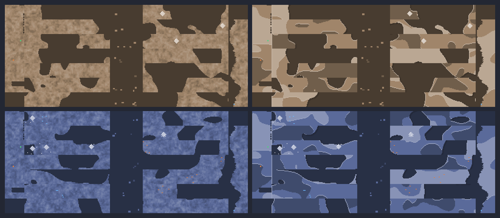
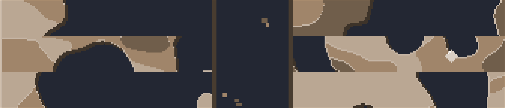

# The cave — paper-cut rock (the art direction, shipped)

The cave is the last piece of the [paper-cut](art-directions.md) direction to
come in. The characters, the crew cast, the skin line and the tool line were
all cut from paper behind the art-pack seam
([`artPack.ts`](../src/utils/graphics/artPack.ts)); the cave was the one
surface that stayed classic, because it is not a sprite pipeline at all — it
is a strip pipeline (336×24 row strips + addressable foreground wall bands,
one shared rock/gap silhouette) with its own noise work.



Left: the classic dithered shade ramp. Right: the shipped paper-cut rock.
Rows are two of the game's cave themes (top: the default rock, bottom: a
deep cold band) so the tint, not the direction, is doing the coloring.

## What changed, and what did not

| | |
| --- | --- |
| **The rock body** | three flat value planes per tier (light / mid / dark), cut along organic boundaries, a lit paper core on every cut edge, a 2px cast shadow off the silhouette |
| **The silhouette** | **untouched.** Same per-pixel layout field, same `ROCK_CHANCE`, same gaps — the rock/gap contour is load-bearing for "no visible patterns" (see `caveTiles.ts`), and this is a direction change, not a layout change |
| **The row / band addressing** | **untouched.** Every row is addressed by absolute depth and every wall band by absolute band, so both directions scroll identically and share one rock body |
| **The wall** | same planes, same jagged cut; the cut keeps its dark accent in both directions (see *the wall* below) |
| **The mine's contents** | **untouched.** Crystals, ore veins, the shaft rubble and the easter eggs stay the flat classic objects they already were — they are already flat, and they read on paper. The rubble takes its chunks from the direction's own stock so the shaft isn't a hole in a different material |

## How it hangs together

Same split the characters use — one geometry, several ways of marking it:

```
caveTiles.ts (unchanged geometry)        caveArt.ts (the direction)
  layoutField / isRockPixel  ─┐
  rockPlaneValue / Index     ─┤──>  CAVE_ROCK_STYLES[art].paint(px)
  rockShadeIndex (classic)   ─┘             │
                                              ├─ classic  → rockShadeRamp (10 steps + dither)
                                              └─ papercut → paintPaperRock (5 colors)
```

- `caveArt.ts` holds the direction: the paper stock (`paperRockInk`) and the
  renderer (`paintPaperRock`), pure and framework-free like the rest of the
  art layer.
- `caveTiles.ts` holds the fields, including the paper-cut **plane field**
  (`rockPlaneValue` → `rockPlaneIndex`, thresholds in `PLANE_EDGES`). A field
  is geometry, not mark-making, so it stays next to the other fields — and it
  has to be sampled at global pixels with a per-tier seed for exactly the same
  reason the silhouette is.
- `artPack.ts` gains one field per pack, `caveArt: "classic" | "papercut"`,
  and `activeCaveArt()` is the single place the pipeline reads the seam. So
  `setActiveArtPack("pixel")` brings back the classic cave **and** the classic
  characters — which is the whole promise of the seam — and the direction is
  part of both cache keys, so a live swap can never serve the other one's
  rock.

## The three rules

`paintPaperRock` is the whole direction:

1. **A flat plane.** Inside a sheet the rock is one flat color, from the
   plane field. Cut paper is flat paper; the character sheets' three planes
   per material is the same idea at sprite scale.
2. **A lit cut edge shows the core.** The first row of rock against open air
   — on the two sides the light comes from — is the lighter paper core, and so
   is the first row of a sheet that tucks under a *lighter* one. The reverse
   (a darker sheet on top) is the overhang's own underside and keeps its
   plane value: that asymmetry is what makes a stack read as a stack instead
   of as contour lines.
3. **A cut sheet casts a shadow.** The silhouette offset two pixels
   down-right onto the gap, exactly the offset `renderPapercut` uses for the
   characters. This is the one mark the cave needs that a character never
   does — a cave's shape is its contour, so the contour is what catches the
   light and throws the shadow.



## The plane field

`PLANE_EDGES` is calibrated for roughly a quarter / a half / a quarter of the
rock (measured 0.22 / 0.54 / 0.24 over 5 tiers × 400×200px): the mid plane
carries the wall and the two ends are the accents, which is the balance a
cut-paper stack wants. The field is deliberately **low frequency** (≈86/44/17px
features, wider than tall so the sheets read as strata) and domain-warped: cut
paper needs big flat plates, and a fine field quantized into three planes is
just mush.

## Flat is not a pattern

The classic ramp's no-block-pattern property is still pinned — and it is pinned
*on the classic direction*, because flat regions are the entire point of the
paper-cut sheets. What the paper-cut sheets must not do is reproduce the block
pattern that ramp was fixed for: a quantized field pins every cut edge to a
pixel lattice, and *that* is what reads as a pattern. So `caveTiles.test.ts`
asserts the other half directly:

- **flat** — most 2×2 cells inside the rock are one color (the style);
- **wandering** — hundreds of cut edges, split roughly evenly across both
  pixel parities (a lattice puts them all on one), and real spread in the
  spacing between two cut edges down a column (a metronome has none).

Plus the cave's original continuity tests, which the flat planes make
*sharper*: a per-row reseed or a per-strip decision would now show up as a
hard 100% mismatch at the strip seam rather than a soft one.

## The wall

The foreground walls get the direction's planes and the same lit lips inside
the column. Their cut edge keeps its dark accent in **both** directions, for
two reasons: the cut faces the shaft, i.e. into the light well, so the wall is
the frame of the diorama and reads best dark; and a cast shadow cannot be
thrown into a hole that has to stay transparent (a stray shadow pixel at the
screen edge is exactly the bug the wall's "at least 12px of rock survives"
rule guards against).

## Re-rendering the sheets

```bash
node scripts/generate-cave-art-samples.mjs
```

writes `cave-directions.png` (one column per direction, one row per theme,
with the two foreground walls at the edges) and `cave-zoom.png` (the rock body
alone at 6×, the read that decides the direction). Ground is the same cave-dark
wash the game puts behind the rows, because on slate the planes and the lit cut
edges have nothing to sit on.

## Still classic, on purpose

- **The gems, ore and easter eggs.** They are hand-authored flat pixel objects;
  re-cutting them is its own job, and the todo list still carries it if it
  ever earns one.
- **The debris shards.** Same reason as before: a 32px rock crushed into the
  12px particle box is mush (see `artPack.papercutPack.debrisSprite`).
- **The custom-skin samples.** The upload path is untouched player data; only
  the baked 16×16 sample sprites are still classic.
