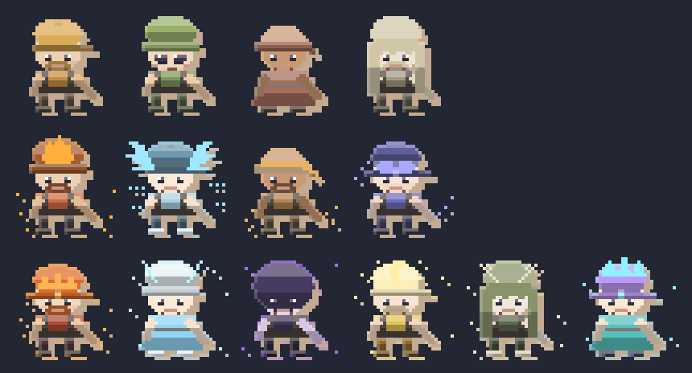
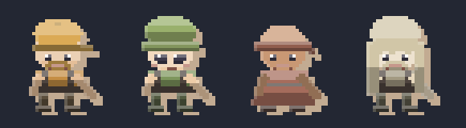
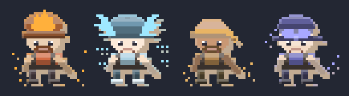
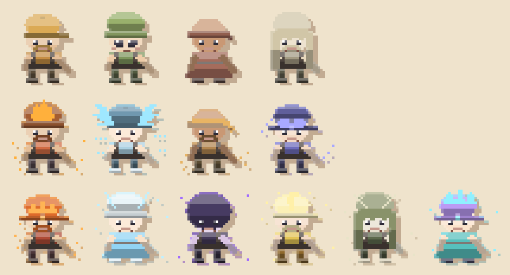
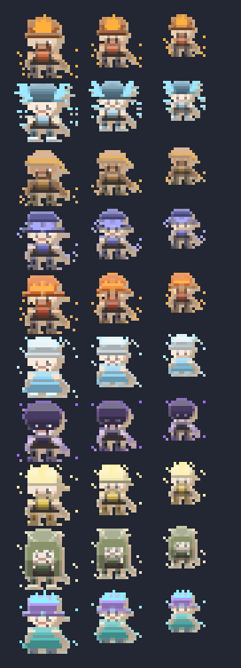

# Crew characters — every purchase you make walks in as a person

Three purchasable miner types, and until now all three rendered **the
player's own look with a different seed**: same body, different palette, at
24px, nine rows deep. That is not what a bought character looks like. Every
purchasable miner is now a **named character with its own art**, in
`src/utils/graphics/crewChars.ts` (tested in `crewChars.test.ts`, sheets
below). The legendary line was the first to get the treatment; the fast and
ordinary lines follow the same rules, dressed to their tier.

## The three lines



| line | costs | visible rows | dressing | cast |
| --- | --- | --- | --- | --- |
| **normal** | minerals | 4 | named faces only — no mark, no motes, no light effects | Cog, Pebble, Tally, Bramble |
| **fast** | gems (Deep Shaft) | 2 | working marks + MOTION motes + a rim light, never a ground pool | Flint, Gale, Cinder, Bolt |
| **legendary** | gems (Motherlode) | 1 | grand marks + static motes + rim light + ground glow | Ember, Rime, Vesper, Gilded, Marrow, Quartz |

The ladder is the point: the aura language (a mark over the headwear, motes
floating around the body, light effects) is **reserved for what costs gems**,
so the crew column itself shows you how deep you are. The ordinary hires are
deliberately plain — they are your hires, in your gear — and their distinct
value is being four *different people* rather than four recolours.

Cast order is **hire order** (`crewCharForIndex(line, index)`): the first
legendary miner a player buys is Ember, the second Rime; the first ordinary
hire is Cog. Both gem lines are named in their shop button
(*"HIRE FLINT, THE SPARK CREW"*, *"HIRE EMBER, THE EMBER CREW"*), and the
ordinary hires are named on the shop's per-crew **"worn by"** chips, so the
cast you are dressing is the cast in the shaft.

## The cast

### Ordinary hires (minerals)

| character | aura | face | blurb |
| --- | --- | --- | --- |
| **Cog** | brass | cap + beard | first through the door every shift, and the last to admit it |
| **Pebble** | moss | beanie, cute face | quiet, quick, and never once late to the winch |
| **Tally** | clay | bandana + ponytail, dress | keeps the books, and the books keep the shift |
| **Bramble** | chalk | long hair + beard | has been down here so long the rock calls them by name |



### Fast crew (Deep Shaft gems)

| character | aura | mark | motes | blurb |
| --- | --- | --- | --- | --- |
| **Flint** | spark | three-toothed crest | hard sparks low (a sprinter's static) | strikes first and hardest, and apologises never |
| **Gale** | wind | a pair of wings | horizontal streaks trailing the body | moves down the shaft like the air got there first |
| **Cinder** | dust | tied kerchief | dust kicked up off the boots | kicks up so much dust the winch crew wears masks |
| **Bolt** | charge | goggles pushed up on the brow | one loose swirl around the shaft | counts the seconds between carts, out loud |



### Legendary line (Motherlode gems)

| character | aura | mark | motes | blurb |
| --- | --- | --- | --- | --- |
| **Ember** | ember | circlet | rising sparks down both flanks | the forge-heart: the rock sweats heat where she swings |
| **Rime** | frost | floating halo ring | drifting flakes in a loose diamond | keeps the shift's water from ever freezing over |
| **Vesper** | void | pointed hood | four hard glints well clear of the body | works the seam after the lamps go out |
| **Gilded** | gold | feather plume | gold sparkle glints | counts every gem twice — once for the math, once for luck |
| **Marrow** | bone | 1px branching antlers | low pale chips | reads the rock like a page, and says what is coming |
| **Quartz** | crystal | crystal spikes | faceted points paired across the body | the seam sings to her and she sings back |


## What makes each one "a unique art style"

1. **A mark worn over the headwear** (`crown` in the label geometry): a
   circlet, a halo, a hood, antlers, a plume, crystal spikes — and for the
   fast line goggles, a kerchief, a crest, wings. The mark is the *silhouette*
   change, and it is what survives at 24px.
2. **An aura colour + a mote pattern** (`motes`): the legendary line's are
   static and precious (sparks, flakes, glints, sparkles, chips, points); the
   fast line's are motion (dust, streaks, static, swirl). Different
   mark-making per aura, not one dot pattern in fourteen colours.
3. **A bespoke palette + face** (hair / hat / outfit / beard / cute), tuned
   per character — Ember is a bearded miner in a helmet, Rime a
   beanie-and-dress, Vesper a hooded figure in shadow colours, Pebble the
   only smile in the ordinary crew.
4. **Two light effects** (`applyAura`, applied after the direction renderer):
   a **rim light** along the top edge of the silhouette in the character's
   accent, and a **ground glow** on the lowest pixel of each column. The
   strength is per line (`fx`): the legendary line gets both, the fast line a
   rim only, the ordinary line neither. The aura material is then re-stamped
   with the exact accent so the signature colour lands pure.

## The wardrobe rule

The ordinary crew are the only line with **per-crew outfits** (a player can
assign an owned outfit to any visible hire, and assignments survive a sunk
shaft). So for them the character owns their **face** and the outfit owns the
**clothes**:

```ts
crewLookFor(char, rollMinerLook(seed, outfitId), /* own */ noAssignment)
```

Nothing is assigned → the character wears their own palette. Something is
assigned → that outfit's colours and headwear, with the character's own hair,
beard, dress and expression. Dressing a hire changes their gear without
turning them back into a seeded look. Pinned by tests in `crewChars.test.ts`
and by the cache-key contract in `artPack.test.ts` (dressed and undressed are
different images).

## Sheets

| sheet | what it is |
| --- | --- |
|  | all three lines, one sheet at 4× |
|  | the same on the cream stock papercut is cut from |
|  | the two gem lines at the sizes the crew column actually draws (24 / 20 / 16 px, shown 3× zoom) — the legibility test that matters: a mark that disappears here is a mark that doesn't exist |

Re-render with `node scripts/generate-crew-char-samples.mjs`.

## How it fits the rest

- **The art pack owns it.** The papercut pack renders crew characters
  (`artPack.minerSpriteUri(look, { crewId, crewWearsOutfit })`); the classic
  pixel pack has no cast and falls back to the plain miner, so `setActiveArtPack("pixel")`
  still works with no special case.
- **No new save data, no new currency.** The cast is derived from the
  existing `miners` / `fastMiners` / `legendaryMiners` counts. Only the crew
  column and the two gem shop buttons changed.
- **The crew still draws its own pickaxe** (the swinging sprite), so no
  character bakes a tool into their body (`tool: false`, pinned by a test).
- **Names are proper nouns**, so they are not i18n'd; the two shop-button
  strings are (`purchase.buyFastMiner`, `purchase.buyLegendaryMiner`, en + es).

## Follow-ups (not done)

- **The cast in the compendium.** `collection.ts` is a pure catalog of owned
  collectibles; crew members are hires, not collectibles, so listing them is
  a product decision (and a new group kind) rather than a data change.
- **Per-character idle motion.** Each character could bob/swing differently
  (Vesper slow, Bolt twitchy) — the animation is currently one shared clock
  with a per-seed phase.
- **The ordinary crew could grow past four.** Only the first four hires
  render (`ROSTER_MAX_PER_TYPE.normal`, which is also the number of
  assignable outfit slots), so the cast is sized to the column, not to the
  player's mineral total.
