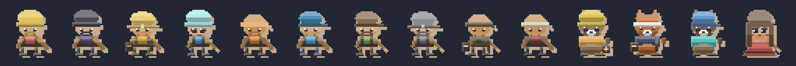
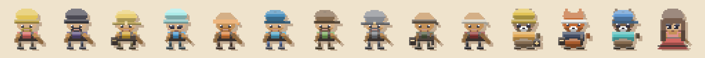

# The outfit line — every paid outfit is a character

The outfit line dresses the player's own slot (like the [skin line](skin-line.md),
which dresses the same slot as a full character). It started as the opposite of
a character line: **each item was a palette** — five pools of shirt / pants /
boots / hat colors plus a hat-style pool — so buying "Crystal Miner" bought the
default miner in turquoise. That is a recolor, and a shop full of recolors is
not a cosmetic line, it is a dye.

Now each paid outfit carries an authored **shape** and the default miner is only
the free starter.

Left to right, in catalog order (the first one is the free starter — it is
deliberately the plain default miner). Same grid on papercut's own cream stock:

Re-render with `node scripts/generate-outfit-line-samples.mjs`.

## The rule

**A paid cosmetic is a character, not a palette.** Three things make it true,
and `cosmetics.test.ts` pins all three:

- **every paid outfit ships a `shape`** (`OutfitCosmetic.shape`, the skin line's
  `SkinShape` minus `tool`/`crown`/`motes`);
- **no two paid outfits draw the same body**, and **no paid outfit is the
  default miner** — asserted on the drawn label map, because a silhouette is
  not a color question;
- **the seed rerolls colors, not the body**: eight different seeds give eight
  different colorways and one silhouette. A character who changes their face on
  every reroll is a palette again.

The hat-style pool collapsed to one entry per outfit for the same reason: the
authored `hatStyle` wins, so leaving two other styles in the pool would leave
dead entries in the catalog (the palette still rolls four hat colors).

## What the shapes are

| outfit | shape | who they are |
| --- | --- | --- |
| **Classic Crew** | *(none)* | the free starter: the plain default miner |
| **Night Shift** | beanie + beard, broad | the grizzled old-timer |
| **Gold Rush** | hard hat, broad, **satchel** | the prospector and his sample bag |
| **Crystal Miner** | beanie, slim, cute | the bright-eyed young one |
| **Lava Worker** | bandana + beard, broad | the heat-burnt driller |
| **Blocky Adventurer** | cap, broad | the cheerful sandbox kid |
| **Frontier Explorer** | cap + beard, slim | the lean scout |
| **Ashen Knight** | hard hat + beard, slim | the armoured one |
| **Wandering Hunter** | bandana, slim, **satchel** | the tracker, bag on the hip |
| **Crimson Oni** | bandana, broad | the vengeance tribute |
| **Burrow Marmot** | **critter**, beanie, cute, **basket** | the hoarder with a full basket |
| **Fox of the Vein** | **critter**, bandana, **satchel** | the resident gambler and the loot bag |
| **Otter of the River** | **critter**, cap, cute | the cheerful river critter |
| **Damsel of the Deep** | **gown**, pretty face, slim, long hair | **the damsel** — a floor-length hem with no boots under it |

The axes are the skin line's (`docs/skin-line.md`): `build` / `gown` / `pretty`
/ `prop` / `hair`, plus the headwear and the critter `form`. The **crown and
aura axes stay with the crew cast** — that mark-making is the premium language
for a hired legend, and putting it on a purchasable outfit would blur it.

## The damsel

`Damsel of the Deep` is the line's damsel and the item that used to be the
clearest example of the problem: its own code comment read "long hair, softer
clothes, **same human body**". She is now a slim build with the pretty face
(flicked lashes, brows, heavier blush) and a **gown** — the one outfit that
reaches the floor and hides the boots, so she is unmistakably not a miner in a
costume. Her colorway still rolls, so two players wearing her differ.

## Why the shape is authored and not rolled

`rollMinerLook` draws the colors from the outfit's pools with the seed, then
appends the shape hints. When an outfit ships a `shape`, those hints are
**copied, not rolled**:

- an extra `pick()` in the stream would reshuffle every existing player's
  miner (the order is pinned by `cosmetics.test.ts`);
- a rolled shape means the item is not a fixed character — "reroll" would
  quietly mean "become someone else".

The free starter keeps the random hints, so the unowned default miner still
varies per seed exactly as before.

## The rest of the paid lines

- **Pickaxes (8)** are already one shape each — `PickaxeCosmetic.tool` picks
  from `characterArt.TOOLS`, and the line has exactly eight tools, so no two
  share a silhouette. Pinned by `cosmetics.test.ts` ("eight TOOLS, not eight
  colors").
- **Cave themes (9)** are a tint by definition: they recolor the rock and the
  wash, and there is no silhouette to give them. The paper-cut cave
  ([cave-art.md](cave-art.md)) is shared by all of them; a theme-specific cave
  *art* direction would be a new piece of work, not a data change.
- **The custom-skin feature pack** is not a cosmetic — it unlocks the upload
  slot.
