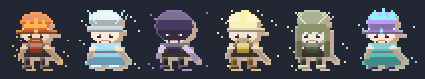
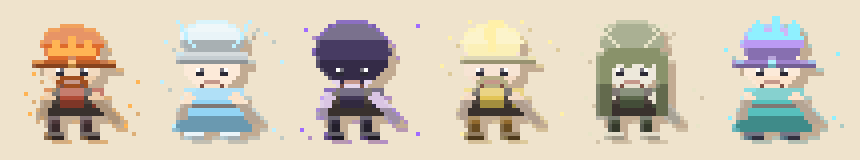
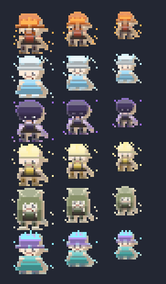

# Premium crew — the legendary miners, given a cast

The third miner type (legendary: the endgame raw-output sink, unlocked at
Motherlode) used to render the **player's own look** with a different seed —
same body, different palette, nine rows deep at 24px. That is not what a
premium character looks like. This is the redesign: six named characters,
each with art that matches their name and aura.

**Shipped** behind the art-pack seam: `artPack.minerSpriteUri(look, {
premiumId })` renders one, and `MiningCanvas` gives every legendary crew row
the character for its hire order. Data + builder in
`src/utils/graphics/premiumChars.ts`, tested in `premiumChars.test.ts`.

## The cast

| # | character | aura | mark | look | blurb |
| --- | --- | --- | --- | --- | --- |
| 1 | **Ember** | ember | crown | helmet + beard, red, dark leather | the forge-heart: the rock sweats heat where she swings |
| 2 | **Rime** | frost | halo | beanie + dress, ice blue | keeps the shift's water from ever freezing over |
| 3 | **Vesper** | void | hood | hooded, deep violet | works the seam after the lamps go out |
| 4 | **Gilded** | gold | plume | cap + beard, gold | counts every gem twice — once for the math, once for luck |
| 5 | **Marrow** | bone | antlers | long hair, moss + bone | reads the rock like a page, and says what is coming |
| 6 | **Quartz** | crystal | crystal | crystal spikes, ponytail, dress | the seam sings to her and she sings back |

The shop's legendary button names the next hire ("HIRE EMBER, THE EMBER
CREW"), so the cast is not a secret — the aura word is the character's, and
the name/aura pair is passed into the existing `purchase.buyLegendaryMiner`
string (en + es).

## What makes each one "a unique art style"

Four things move together, and all four are needed — a recolor alone was the
thing this replaces:

1. **A mark worn over the headwear** (`crown` axis in the label geometry):
   a circlet, a floating halo ring, a pointed hood, a feather plume, 1px
   branching antlers, crystal spikes. This is the *silhouette* change, and it
   is what survives at 24px.
2. **An aura colour + a mote pattern** (`motes`): rising ember sparks down
   the flanks, drifting frost flakes in a loose diamond, four hard void
   glints well clear of the body, gold sparkle glints, low bone chips,
   paired crystal points. Different mark-making per aura, not one dot pattern
   in six colors.
3. **A bespoke palette + shape**: the same axes the skin line uses (hair,
   hat, outfit, beard, cute), tuned per character — Ember is a bearded miner,
   Rime a beanie-and-dress, Vesper a hooded figure in shadow colors.
4. **Two premium light effects** (`applyAura`), applied after the direction
   renderer: a **rim light** along the top edge of the silhouette in the
   character's accent, and a weaker **ground glow** on the lowest pixel of
   each column. The aura material (crown + motes) is then re-stamped with the
   exact accent so the signature color lands pure.

Plus the shape axes give the crew real variety even without a mark: long hair
with a ponytail, a dress, a beard.

## Sheets

| sheet | what it is |
| --- | --- |
|  | the cast at 4× on the dark slate (comparable with the other art sheets) |
|  | the same on the cream stock papercut is cut from |
|  | every character at the sizes the crew column actually draws (24 / 20 / 16 px, shown 3× zoom) — the legibility test that matters: a mark that disappears here is a mark that doesn't exist |

Re-render with `node scripts/generate-premium-char-samples.mjs`.

## How it fits the rest

- **The art pack owns it.** The papercut pack renders premium characters; the
  classic pixel pack has no premium line and falls back to the plain miner
  (one line in `artPack.ts`). Swapping the art back needs no special case.
- **Hire order, not gacha.** `premiumCharForIndex(legendaryMiners)` — the
  first legendary hire is Ember, the second Rime, and the line wraps past the
  sixth. Legendary miners are a gem purchase, not a drop, so the cast has to
  be reachable by buying them; the order is the roster order.
- **No new save data, no new currency.** It rides the existing
  `legendaryMiners` count. The crew column is the only place that changes.
- **The crew still draws its own pickaxe** (the swinging sprite), so no
  character bakes a tool into their body (`tool: false`, pinned by a test).
- **The fast crew is unchanged** — those are the player's look, by design; the
  premium type is the one that gets a cast.

## Follow-ups (not done)

- **Names in the Collection compendium.** `collection.ts` is a pure catalog of
  owned collectibles; the premium crew is a hire, not a collectible, so adding
  it is a product decision (and a new group kind) rather than a data change.
- **Per-character idle motion.** Each character could bob/swing differently
  (Vesper slower, Quartz twitchy) — the animation is currently one shared
  clock with a per-seed phase.
