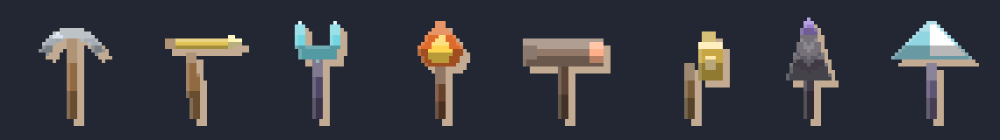
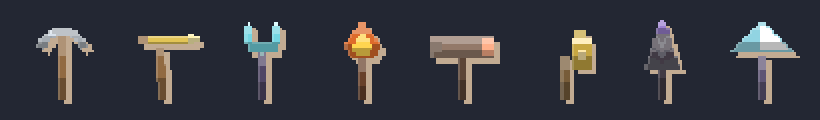
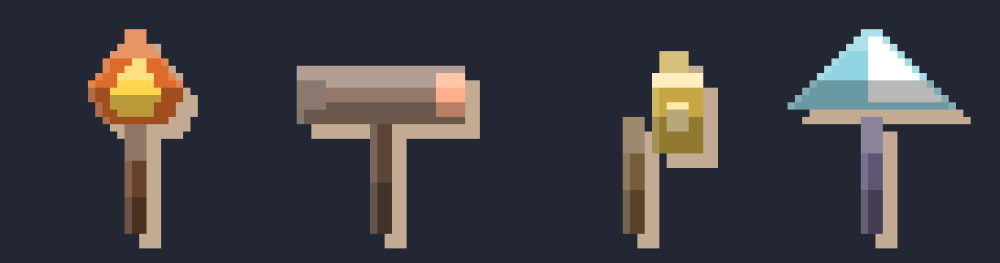

# The tool line — eight pickaxes that are eight *objects*

The pickaxe line was the last cosmetic line that was still a recolor: every
pickaxe was the same crescent head in a different three-color theme, and the
only differences were the swing speed and the strike sound. Now the line has a
**shape axis** — one distinct tool per cosmetic — so buying a pickaxe buys an
object.

## The cast (shop order: by price)

| # | pickaxe | gems | tool | swing / bounce | blurb |
| --- | --- | --- | --- | --- | --- |
| 1 | **Steel** | free | Pickaxe | 150 ms / 6 px | the shift standard: honest steel, nothing fancy |
| 2 | **Gold** | 25 | Mattock | 190 / 8 | a squared adze — the gem counter's favorite |
| 3 | **Crystal** | 45 | Lance | 110 / 4 | a forked lance that leaves the seam cold |
| 4 | **Emberbrand** | 60 | Emberbrand | 200 / 7 | a burning brand — the rock smokes where it lands |
| 5 | **Cinder Sledge** | 75 | Sledge | 260 / 12 | the biggest head in the crate; it does not need finesse |
| 6 | **Lantern Hook** | 85 | Lantern Hook | 140 / 5 | hangs its own light on the gallery wall |
| 7 | **Shadow** | 90 | Auger | 230 / 10 | a spiral bit that eats the seam instead of striking it |
| 8 | **Prism Cutter** | 100 | Prism Cutter | 170 / 8 | cuts the seam at an angle the light likes |

Three things move together per tool, which is what makes the line a line
rather than a palette: the **silhouette** (`characterArt.TOOLS` →
`pickaxeLabels(tool)`), the **swing feel** (`feel.swingMs` /
`bounceDepth` — the Crystal lance is a flick, the Sledge is a shove) and the
**strike sound** (a synthesized WAV per tool,
`scripts/generate-pickaxe-sounds.mjs` — the Prism Cutter's long glassy ring
against the Sledge's near-silent thud is the clearest example).

All eight are sold like every other line: **gems in game, real money in the
stores** (guardrail 1). The cash price is the tool's **depth tier**
(`cosmetics.CASH_PRICE_USD`; the ladder is in
`docs/store-integration.md` §2.1c) — Gold's plain adze is $0.99, the three
tools that brought a new shape *and* a new sound are $2.99, and the Prism
Cutter — the most faceted thing in the line — is $3.99.

## How a tool is drawn

All eight share one framing — head in the top third, haft running to the
bottom — because `Miner` rotates the tool sprite around a fixed origin for the
swing. A tool with a different mass would swing wrong. Only three materials
are used (`blade`, `bladeShine`, `handle`), which is exactly what a
`PickaxeThemeDef` maps, so a tool's colors come from its theme and its shape
comes from its id. The classic `pixel` pack has no shape axis: there every
tool is the crescent colorway.

`artPack.pickaxeSpriteUri(theme, tool)` keys its cache on **both**, so eight
tools never share a decoded image (nor do two themes of the same tool).

## Sheets

| sheet | what it is |
| --- | --- |
|  | the line in shop order at 4× |
|  | the same eight at the size the swing animation draws them (44 px, shown 2×) — the read that matters: can you tell the tools apart mid-swing |
|  | the four newest at 8× |

Regenerate with `node scripts/generate-tool-line-samples.mjs`.

## Tests

`src/mines_of_doom/__test__/cosmetics.test.ts` pins the line's contracts: one
distinct tool per pickaxe, no tool table entry the catalog doesn't use, a
distinct silhouette per tool (compared as rendered grids, so a shared theme
can't hide a shared shape), and no tool reaching for a material the palette
doesn't map.